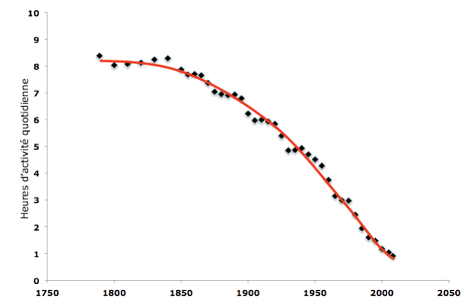
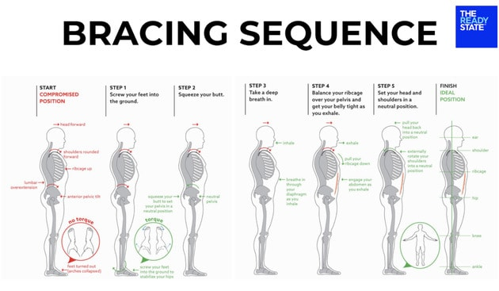

# Le piège de la chaise

## Sitting is the new smoking

L’Organisation mondiale de la Santé (OMS) actualise régulièrement la liste des principaux facteurs de mortalité _évitables_. Depuis près de vingt ans, **l’inactivité physique** se maintient au **4ᵉ rang**, à l’origine d’environ **4 à 5 millions de décès chaque année** , davantage que la consommation nocive d’alcool. 

Au cours du dernier siècle, le temps quotidien consacré à l’activité physique est passé d’environ six heures à moins d’une heure, illustrant une « immobilité éclair » dont les répercussions sur l’organisme sont majeures.

| Facteur de risque (OMS)                   | Décès mondiaux attribuables / an* | Rang approximatif parmi les causes évitables | Commentaire clé                                                                                                                                                                                                               |
| ----------------------------------------- | --------------------------------- | -------------------------------------------- | ----------------------------------------------------------------------------------------------------------------------------------------------------------------------------------------------------------------------------- |
| **Inactivité physique / sédentarité**     | **≈ 4 – 5 millions**              | 4ᵉ                                           | En bougeant davantage on pourrait éviter 4–5 M de décès chaque année. [who.int](https://www.who.int/health-topics/physical-activity?utm_source=chatgpt.com)                                                                   |
| **Tabagisme (actif + passif)**            | **> 8 millions**                  | 2ᵉ                                           | La moitié des fumeurs meurent des suites du tabac ; plus de 1,3 M de victimes sont des non-fumeurs exposés à la fumée. [who.int](https://www.who.int/health-topics/tobacco?utm_source=chatgpt.com)                            |
| **Hypertension artérielle non contrôlée** | **≈ 10 millions**                 | 1ʳᵉ                                          | “Tueur silencieux” n°1 : première cause de mortalité évitable dans le monde. [who.int](https://www.who.int/teams/noncommunicable-diseases/hypertension-report?utm_source=chatgpt.com)                                         |
| **Consommation nocive d’alcool**          | **≈ 2,6 – 3 millions**            | ~7ᵉ                                          | Responsable d’environ 1 décès sur 20, essentiellement chez les hommes. [who.int](https://www.who.int/news/item/25-06-2024-over-3-million-annual-deaths-due-to-alcohol-and-drug-use-majority-among-men?utm_source=chatgpt.com) |

## Contexte

Pendant des centaines de milliers d’années, l’_Homo sapiens_ a passé l’essentiel de son temps à se déplacer : chasse, cueillette, trajets entre campements… Notre squelette, nos muscles et notre métabolisme se sont donc façonnés pour un mode de vie **actif et endurant**.

Ce modèle a été bouleversé en l’espace de quelques siècles, puis s’est accéléré ces dernières décennies : travail de bureau, visioconférences, voiture individuelle, streaming, smartphone… Résultat : nous restons assis **plus de dix heures par jour** en moyenne.

Or, une articulation sollicitée dans son amplitude normale est dimensionnée pour fonctionner **au moins  110 ans** sans douleur. Quand des trentenaires se plaignent déjà de lombalgies, il y a clairement un problème : le **défaut de mouvement** use nos structures avant l’heure et ouvre la porte aux maladies métaboliques (diabète 2, affections cardiovasculaires) autant qu’aux douleurs musculo‑squelettiques.

![[Pasted image 20250708155238.png]](sidebar-featured.png)

---

  

  

**Ne ratez plus aucune nouveauté : abonnez-vous à la newsletter 👋**

  

<form action="https://formspree.io/f/xwpkgwjd" method="POST" style="display:inline-block;">

  

  <label for="email" style="display:block; margin-bottom:0.5rem;">Votre email :</label>

  <input type="email" name="email" id="email" placeholder="exemple@domaine.com" required style="margin-bottom:0.5rem;">

  

  <button type="submit">Envoyer</button>

</form>

  

---

## Consequences et Risque associées de la posture assise

Le corps humain — notamment la colonne vertébrale — est remarquablement robuste et tend spontanément vers l’équilibre. En posture assise prolongée cependant, cet équilibre se fait au prix de compensations (bassin en rétroversion, cyphose lombaire, rotation interne des épaules) qui, à terme, favorisent les troubles musculo‑squelettiques et déclenchent une cascade d’effets systémiques.

Les risques associés à ces troubles sont multiples :

- **Sportifs** : baisse de performance, augmentation du risque de blessure.
    
- **Mentaux** : comme l’explique _The Revolutionary New Science of Exercise and the Brain_, le cerveau réagit comme un muscle ; l’inactivité le fait littéralement « fondre », avec un impact négatif direct sur nos capacités cognitives et notre santé mentale à long terme.

![[Pasted image 20250708164230.png]](sitting.png)

## Comment se positionner en « mode neutre » pour la colonne

La position biomécanique idéale pour la colonne est la **position neutre**. Elle est difficile à maintenir en restant assis ; la position debout reste privilégiée pour y parvenir.

Pour se remettre en position neutre, il faut, dans cet ordre :

1. Placer les pieds latéralement, bien perpendiculaires.
    
2. Contracter les fessiers pour bien positionner le bassin.
    
3. Maintenir une légère tension de la sangle abdominale (comme si vous anticipiez une tape sur le ventre).
    
4. Placer les épaules en rotation externe.

## La solution : **Bien bouger, bouger souvent**

> **“Move well, move often.”** — _Gray Cook_

L’ordre ici est capital : avant de chercher à « faire plus », il faut **faire mieux**. Prioriser la qualité du mouvement garantit que chaque articulation fonctionne dans son amplitude naturelle, limite les compensations et prévient l’inflammation.

### 1. Optimiser la position quand on doit rester assis

Quand on est assis, limiter les dégâts en conservant la neutralité de la colonne : fessiers actifs, épaules en rotation externe et sangle abdominale engagée.

### 2. Fractionner la station assise

Bouger régulièrement dès que le besoin s’en fait sentir – par exemple, au bureau, en alternant périodes de travail assis et debout.

> For every 30 minutes that you are desk‑bound, move for at least 2 minutes. Prioritize position and mechanics whenever you can. Perform 10 to 15 minutes of daily maintenance on your body.

### 3. Programmer 10–15 min de « maintenance » corporelle quotidienne

Mettre en place un protocole de maintenance pour contrebalancer les mauvaises postures de la journée, par exemple :

- **Cat & Cow** — enchaînement de flexion/extension de la colonne qui mobilise la zone thoraco‑lombaire et lubrifie les disques intervertébraux. _Durée : 2 min._ [Vidéo 3 min](https://www.youtube.com/watch?v=y39PrKY_4JM)
    
- **Couch Stretch** — étirement profond du psoas et du quadriceps, essentiel pour restaurer l’extension de hanche. _Durée : 2 min par côté._ [Vidéo 9 min](https://www.youtube.com/watch?v=ulgAOykAgV4)
    
- **Pectoral Stretch (doorway)** — ouvre la cage thoracique et libère les épaules en rotation externe. _Durée : 2 min par côté._ [Vidéo 2 min](https://www.youtube.com/watch?v=Dmm8_S23I74)** : 2 min de chaque côté.

---

  

  

**Ne ratez plus aucune nouveauté : abonnez-vous à la newsletter 👋**

  

<form action="https://formspree.io/f/xwpkgwjd" method="POST" style="display:inline-block;">

  

  <label for="email" style="display:block; margin-bottom:0.5rem;">Votre email :</label>

  <input type="email" name="email" id="email" placeholder="exemple@domaine.com" required style="margin-bottom:0.5rem;">

  

  <button type="submit">Envoyer</button>

</form>

  

---

# SOURCE

1. Organisation mondiale de la Santé. _Activité physique : faits et chiffres._ WHO Fact Sheet. Consulté le 11 juillet 2025, à l’adresse : https://www.who.int/fr/news-room/fact-sheets/detail/physical-activity
    
2. Mostakhdemin, N., _et al._ (2021). _Titre de l’article non communiqué._ _Revue non précisée._
    
3. Starrett, K. (2015). _Deskbound: Standing Up to a Sitting World._ Victory Belt Publishing.
    
4. Coach Panda. (2018, 15 mars). _The Principles of Human Movement._ Hey Coach Panda (blog). https://heycoachpanda.wordpress.com/2018/03/15/the-principles-of-human-movement/
    
5. The Ready State. (s.d.). _The Ready State_ [site web]. Consulté le 11 juillet 2025, à l’adresse : https://thereadystate.com

