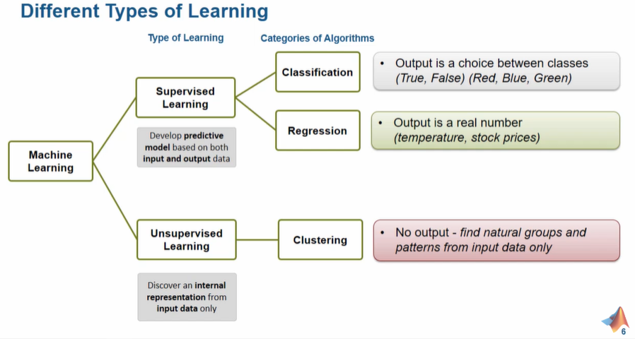
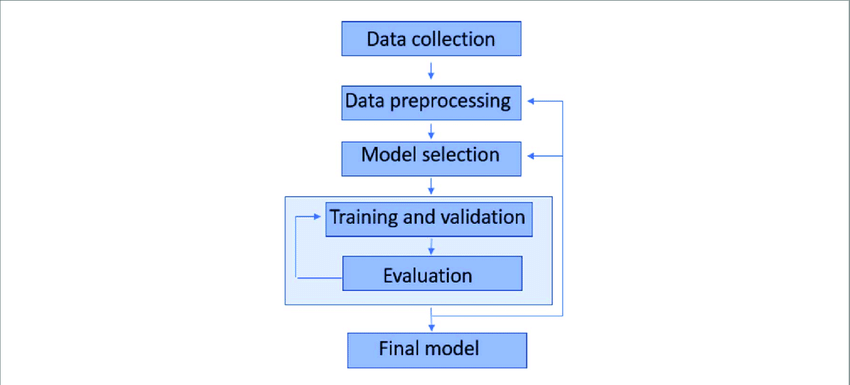
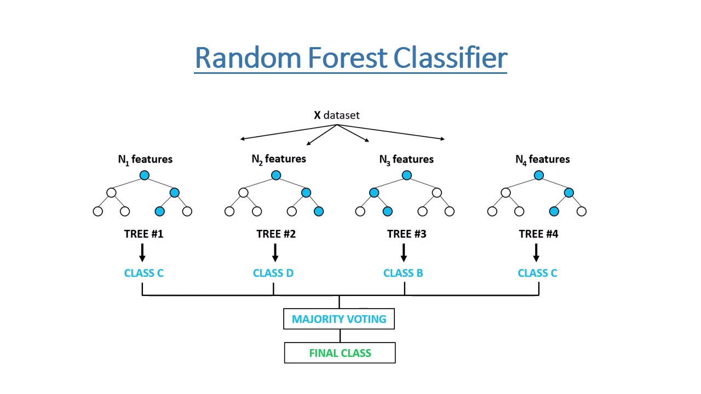

# Introduction et contexte du machine learning — le workflow

L’objectif du machine learning, c’est **de ne pas avoir besoin de connaître toutes les équations scientifiques** qui décrivent un système.  
Avec un modèle physique classique, on part des lois (mécaniques, chimiques…) → on prend les entrées → on calcule les sorties.
Mais parfois, ces lois sont **trop complexes** ou **impossibles à écrire précisément**.

👉 Le **machine learning** propose une autre approche :

> « Et si, au lieu de connaître les équations, on apprenait directement des exemples ? »

### 🔁 Un changement de logique

- **Modèle classique** : on connaît les lois → on calcule la sortie à partir des entrées.
    
- **Machine learning** : on donne **plein d’exemples d’entrées et de sorties**, et le modèle apprend **la règle générale** tout seul.

### 🎯 Précision du modèle : l’accuracy

Une fois entraîné, le modèle doit être capable de **prédire une sortie correcte** à partir d’une **nouvelle entrée qu’il n’a jamais vue**.

Mais attention : un modèle n’est jamais parfait !

Par exemple, un modèle avec **80 % de précision** veut dire qu’il donne la bonne réponse 8 fois sur 10… mais se trompe encore dans 20 % des cas.

> **L’objectif ?** Obtenir la **meilleure précision possible** (accuracy), sans surcharger inutilement le modèle.

Le but est simple : **maximiser cette précision**.  
Et pour ça, deux leviers principaux :

- **Plus de données pertinentes** : capteurs, mesures, signaux fiables → plus de matière à apprendre.
- **Un modèle plus adapté** : parfois un modèle plus complexe (mais pas trop !) permet d’améliorer les performances.

### 🧠 Typologie de modèles

Le choix du modèle dépend :

- du type de sortie attendue (ex : une **classe** → modèle de classification ; une **valeur continue** → régression),
    
- et du type d’apprentissage :
    
    - **supervisé** : on connaît les réponses pendant l’apprentissage,
        
    - **non supervisé** : on cherche à découvrir des structures dans les données (ex : regroupements).
        

### 🔁 Le workflow du machine learning, étape par étape

Quel que soit le problème, la **démarche reste la même** :

1. **Collecte des données** : capteurs, sondes, bases existantes
    
2. **Nettoyage et préparation** : vérifier, convertir, formater les données
    
3. **Choix du type d’apprentissage** :
    
    - _Supervisé_ : on a les réponses (ex : qualité du lait)
        
    - _Non supervisé_ : on n’a pas les réponses (ex : grouper des profils similaires)
        
4. **Entraînement du modèle** : on lui montre les exemples et il apprend
    
5. **Évaluation** : on vérifie sur des données nouvelles s’il se débrouille bien
    
6. **Déploiement** : sur le cloud, dans un appareil embarqué, ou intégré dans un process industriel

---

**Ne ratez plus aucune nouveauté : abonnez-vous à la newsletter 👋**

<form action="https://formspree.io/f/xwpkgwjd" method="POST" style="display:inline-block;">

  <label for="email" style="display:block; margin-bottom:0.5rem;">Votre email :</label>
  <input type="email" name="email" id="email" placeholder="exemple@domaine.com" required style="margin-bottom:0.5rem;">

  <button type="submit">Envoyer</button>
</form>

---

# Prédiction de la qualité du lait avec le machine learning

Pour illustrer concrètement la méthode du machine learning, prenons un **cas pratique**.  
Le site [Kaggle](https://www.kaggle.com) propose des **jeux de données gratuits** pour s'entraîner. Ici, nous allons utiliser un dataset qui contient des mesures sur des échantillons de lait, et essayer de prédire automatiquement leur **qualité**.

> 🔧 Le projet est réalisé en **Python**, avec la bibliothèque **Scikit-learn**, (le lien avec le code source est disponible en bas de l’article).

🎯 **Objectif**
Ce projet a pour but de **prédire automatiquement la qualité du lait** à partir de mesures physico-chimiques et sensorielles, en utilisant des algorithmes de machine learning supervisé.

L’objectif final est multiple : 

- ✅ **Fiabiliser et automatiser les contrôles qualité** : en remplaçant ou en complétant les inspections manuelles, souvent subjectives et coûteuses, par un système d’aide à la décision rapide, répétable et objectivable.
- 💡 **Optimiser les processus industriels** : en détectant en temps réel les dérives de production (pH, goût, turbidité, etc.), le modèle permet d’anticiper les non-conformités, d’ajuster les paramètres de fabrication ou de trier les lots efficacement.
- 💰 **Réduire les coûts de production et les pertes**, en identifiant précocement les lots non conformes ou dégradés, ce qui permet d’agir rapidement (ajustement du processus, élimination ou revalorisation des lots impropres à la consommation).

📊 À propos du dataset :

Les données sont disponibles dans un simple fichier **CSV** (`milknew.csv`)
Le jeu de données contient 1059 échantillons de lait, collectés manuellement, chacun décrit par 7 variables indépendantes. 

**Résumé des variables (features)**

|**Variable**|**Description**|**Valeurs possibles**|
|---|---|---|
|`pH`|Mesure de l’acidité ou de l’alcalinité du lait. Influence la fraîcheur et la stabilité.|Valeurs continues entre 3.0 et 9.5|
|`Temperature`|Température de l’échantillon lors de l’analyse. Impacte la qualité microbiologique.|Valeurs continues entre 34°C et 90°C|
|`Taste`|Évaluation sensorielle du goût du lait, réalisée par un testeur ou un capteur.|0 = mauvais goût, 1 = bon goût|
|`Odor`|Évaluation olfactive, révélant la fraîcheur ou d’éventuelles altérations.|0 = mauvaise odeur, 1 = bonne odeur|
|`Fat`|Teneur en matière grasse, un indicateur clé pour la texture et la valeur nutritionnelle.|0 = faible, 1 = élevée|
|`Turbidity`|Mesure de la turbidité (opacité), souvent liée à des particules indésirables.|0 = limpide, 1 = trouble|
|`Colour`|Indication de la couleur du lait, influencée par la composition ou l’oxydation.|Valeurs entières entre 240 et 255|

La **variable cible** `Grade` indique la qualité du lait :

- `Low` → mauvaise qualité
    
- `Medium` → qualité moyenne
    
- `High` → bonne qualité

🧪 Ces classes ont été déterminées en fonction de seuils sur les variables décrites ci-dessus. Certaines d’entre elles sont binarisées selon des critères experts (ex. : goût acceptable = 1), tandis que d’autres (comme le pH ou la température) conservent leur valeur continue.
## Exploration des données 

🧹 Vérification et nettoyage des données

Nous commençons par une **analyse exploratoire du fichier CSV** fourni afin de :

- vérifier l’intégrité du jeu de données (présence de données manquantes),
- identifier le type de données associé à chaque variable.

**Aperçu des 5 premières lignes**

|   | pH  | Temprature | Taste | Odor | Fat | Turbidity | Colour | Grade  |
| - | --- | ---------- | ----- | ---- | --- | --------- | ------ | ------ |
| 0 | 6.6 | 35         | 1     | 0    | 1   | 0         | 254    | high   |
| 1 | 6.6 | 36         | 0     | 1    | 0   | 1         | 253    | high   |
| 2 | 8.5 | 70         | 1     | 1    | 1   | 1         | 246    | low    |
| 3 | 9.5 | 34         | 1     | 1    | 0   | 1         | 255    | low    |
| 4 | 6.6 | 37         | 0     | 0    | 0   | 0         | 255    | medium |

📋 **Résumé des types de données :**

| # | Colonne        | Valeurs non nulles | Type    |
| - | -------------- | ------------------ | ------- |
| 0 | **pH**         | 1059               | float64 |
| 1 | **Temprature** | 1059               | int64   |
| 2 | **Taste**      | 1059               | int64   |
| 3 | **Odor**       | 1059               | int64   |
| 4 | **Fat**        | 1059               | int64   |
| 5 | **Turbidity**  | 1059               | int64   |
| 6 | **Colour**     | 1059               | int64   |
| 7 | **Grade**      | 1059               | object  |

👉 **Résultat de l’analyse initiale :**

- Le dataset contient bien **1059 échantillons**, sans **aucune donnée manquante**.
- La typologie des colonnes est cohérente :
    - Les **données continues** (`pH`, `Temperature`) sont de type `float64` ou `int64` selon la précision,
    - Les **variables binaires** (`Taste`, `Odor`, `Fat`, `Turbidity`) sont de type `int64`,
    - La variable cible `Grade` est de type `object` (catégorielle, texte)

🔎 Aucune transformation n’est nécessaire à ce stade en ce qui concerne les types de données ou la gestion des valeurs manquantes. Le dataset est donc prêt à être utilisé pour l’étape de **prétraitement**.

## Statistiques descriptives

Avant de construire un modèle de machine learning, il est essentiel de **comprendre la structure et la distribution des données**.  
Nous commençons donc par une analyse descriptive pour identifier les tendances générales et les relations entre les variables.

Cette phase se décompose en trois étapes :

1. **Analyse des valeurs centrales** (moyenne, médiane, quartiles) pour visualiser la **répartition des variables** et détecter d’éventuelles asymétries ou valeurs extrêmes.
    
2. **Analyse univariée** à l’aide de **boxplots**, pour observer la dispersion et repérer les outliers.
    
3. **Analyse bivariée** via une **matrice de corrélation**, afin d’évaluer les relations linéaires entre les variables et identifier les éventuelles redondances.
    

Ces éléments nous permettront d’**anticiper la pertinence de chaque variable dans le modèle prédictif**, et d’orienter la phase de sélection de features.

### Résumé des statistiques descriptives

|       | pH       | Temprature | Taste    | Odor     | Fat      | Turbidity | Colour   |
| ----- | -------- | ---------- | -------- | -------- | -------- | --------- | -------- |
| count | 1059.000 | 1059.000   | 1059.000 | 1059.000 | 1059.000 | 1059.000  | 1059.000 |
| mean  | 6.630    | 44.227     | 0.547    | 0.432    | 0.671    | 0.491     | 251.840  |
| std   | 1.400    | 10.098     | 0.498    | 0.496    | 0.470    | 0.500     | 4.307    |
| min   | 3.000    | 34.000     | 0.000    | 0.000    | 0.000    | 0.000     | 240.000  |
| 25%   | 6.500    | 38.000     | 0.000    | 0.000    | 0.000    | 0.000     | 250.000  |
| 50%   | 6.700    | 41.000     | 1.000    | 0.000    | 1.000    | 0.000     | 255.000  |
| 75%   | 6.800    | 45.000     | 1.000    | 1.000    | 1.000    | 1.000     | 255.000  |
| max   | 9.500    | 90.000     | 1.000    | 1.000    | 1.000    | 1.000     | 255.000  |

![[Pasted image 20250730161934.png]](histo.png)

- ✅ **Aucune donnée manquante** : toutes les colonnes comptent 1059 valeurs.
- 📉 **pH** : moyenne autour de 6.6, valeurs extrêmes entre 3.0 et 9.5 — quelques cas atypiques possibles.
- 🌡 **Température** : moyenne à 44 °C, avec des pointes jusqu’à 90 °C — probablement des cas particuliers ou expérimentaux.
- 🎨 **Couleur** : très homogène (moyenne à 251.8), majorité des échantillons proches du blanc standard (255).

**Variables binaires :**

- 😋 **Goût (`Taste`)** : environ 55 % des échantillons sont jugés bons.
- 👃 **Odeur (`Odor`)** : plus de la moitié présentent une odeur mauvaise.
- 🧈 **Matière grasse (`Fat`)** : 67 % des échantillons ont une teneur élevée.
- 💧 **Turbidité** : bien répartie entre limpide et trouble (valeurs équilibrées).

🧠 Ces tendances permettront d’orienter la phase de modélisation et d’identifier les variables les plus discriminantes pour la prédiction de la qualité.

### Boxplots par variable — _Analyse univariée_

Ces diagrammes permettent d’analyser la **distribution** de chaque variable et d’identifier les **valeurs aberrantes (outliers)**.

- **pH** : Distribution centrée autour de 6,6. Quelques outliers vers le bas (< 4) et le haut (> 8.5), à surveiller.
- **Temperature** : Médiane autour de 41-44°C. Des outliers élevés jusqu’à 90°C → échantillons potentiellement atypiques ou erreurs de saisie.
- **Taste / Odor / Fat / Turbidity** : Variables binaires (0 ou 1), donc représentées par des barres fines → distribution claire (présence/absence).
- **Colour** : Distribution concentrée vers 255, avec quelques valeurs plus basses (~240), reflétant une variation de teinte perceptible dans peu d’échantillons.

👉 **Conclusion** :

- Peu de variabilité sur les données binaires (discrètes).
- `Temperature` et `pH` nécessitent une attention particulière pour un éventuel **traitement des valeurs extrêmes**.

![[Pasted image 20250730160622.png]](boxplot.png)

### **Matrice de corrélation (%)**  (Analyse bivariée)

Cette heatmap montre les **corrélations linéaires** entre les variables (coefficient de Pearson) exprimées en pourcentage.

**💡 Corrélations significatives :**

- `Odor` est positivement corrélée à :
    
    - `Taste` (**32 %**)
    - `Fat` (**31 %**)
    - `Turbidity` (**46 %**)  
        → Une **bonne odeur est souvent associée à un bon goût, une forte teneur en graisse et un lait trouble**, ce qui peut refléter un lait riche mais non homogénéisé.

- `Fat` ↔ `Taste` : **32 %**  
    → La matière grasse influence positivement la perception du goût.
- `Fat` ↔ `Turbidity` : **33 %**  
    → Plus de matière grasse → lait plus trouble, ce qui est logique.
- `pH` a une faible corrélation avec toutes les autres variables.  
    → Il varie indépendamment du reste → **bonne variable discriminante potentielle.**

**🔍 Corrélations faibles / négligeables :**

- `Colour` est **peu corrélée** aux autres variables.
- `Temperature` n’est pas fortement liée aux critères sensoriels (goût, odeur…).

![[Pasted image 20250730161806.png]](correlation.png)

## **Résumé exploratoire synthétique**

L’analyse préliminaire du jeu de données met en évidence les points suivants :

- ✅ **Données propres** : 1059 échantillons, aucune valeur manquante.
    
- 📉 **Variables continues** (`pH`, `Temperature`, `Colour`) :
    
    - Quelques **valeurs extrêmes** (notamment pour `Temperature` jusqu’à 90 °C).
        
    - `Colour` est très concentrée autour de 255 → **faible variabilité**.
        
- 🔢 **Variables binaires** (`Taste`, `Odor`, `Fat`, `Turbidity`) :
    
    - `Fat` est majoritairement élevée (67 %),
        
    - `Odor` est plus souvent mauvaise,
        
    - Variables globalement **bien réparties** entre 0 et 1.
        
- 📦 **Boxplots** :
    
    - Confirment les observations ci-dessus,
        
    - Outliers visibles pour `Temperature` et `pH` uniquement.
        
- 🔗 **Corrélations** :
    
    - Relations fortes entre variables sensorielles : `Taste`, `Fat`, `Odor`, `Turbidity`,
        
    - `pH` et `Colour` sont **peu corrélés aux autres** → apportent une information indépendante.

## Développer un modèle prédictif avec le _machine learning_

Maintenant que nos données sont prêtes, voyons **comment créer un « modèle »** qui va apprendre à reconnaître la qualité du lait. Imaginez :

- On montre au modèle **beaucoup d’exemples** de lait dont on connaît déjà la qualité.
    
- Le modèle étudie les mesures (goût, odeur, pH…) et repère des **motifs**.
    
- Puis, sur un nouvel échantillon, il prédit si la qualité est « Low », « Medium » ou « High ».
    

###  Choix du modèle : la forêt d’arbres de décision

Dans notre cas, nous utilisons un **apprentissage supervisé**, car nous connaissons la **sortie attendue** : c’est un problème de **classification**, puisque la sortie est une **classe** (le grade du lait).

Nous avons choisi un algorithme de type **Random Forest** (forêt aléatoire d’arbres de décision), car il est :

- **robuste** face au bruit dans les données,
    
- **performant** même sans réglages poussés,
    
- et nécessite **peu d'ajustements** pour obtenir de bons résultats.

**🧠 Un arbre de décision, c’est quoi ?**

On peut le comparer à un petit **organigramme logique** :

> « Si la matière grasse > X, alors bonne qualité ; sinon, vérifier l’odeur… »

Chaque **arbre** prend ses propres décisions sur la base de critères simples.

**🔧 Paramètres choisis**

Par défaut, pour l'entraînement, nous avons utilisé **100 arbres** dans la forêt.

### Entraînement vs évaluation : pourquoi on découpe les données

Pour que le modèle apprenne et qu’on puisse mesurer s’il est vraiment bon, on sépare les données en deux morceaux :

- **X_train** et **y_train** : ce sont les entrées (X_train) et les bonnes réponses (y_train) que le modèle voit pendant **l’entraînement**. C’est là qu’il apprend les règles à partir des exemples.
    
- **X_test** et **y_test** : ce sont des données **nouvelles**, que le modèle **n’a pas vues** pendant l’entraînement. On les utilise pour **évaluer** sa capacité à généraliser — autrement dit, pour vérifier qu’il ne fait pas que « mémoriser » mais qu’il sait bien prédire sur du neuf.
    

> En résumé : on entraîne avec `X_train`/`y_train`, on teste avec `X_test`/`y_test`. Cela permet de savoir si le modèle fonctionne vraiment et pas seulement sur les exemples qu’on lui a montrés.
### Interprétation des résultats du modèle à l’aide de la matrice de confusion

La **matrice de confusion** est un tableau qui compare ce que le modèle a **prédit** avec ce qui était **vraiment vrai**.  
Chaque ligne correspond à la classe vraie, chaque colonne à la classe prédite. L’idée : voir non seulement combien de prédictions étaient correctes, mais _dans quel sens_ les erreurs ont été faites.
On voit **non seulement que le modèle est bon**, mais aussi **quel type d’erreur il fait**.

Ici dans notre cas on peut noter : 
- **Précision globale élevée** : la majorité des échantillons ont été correctement classés.
    
- Le modèle a :
    
    - correctement identifié **85/86** laits de qualité `low`,
	    - **1 a été confondu avec `high`**. Autrement dit, un lait mauvais a été jugé comme bon — c’est une erreur à surveiller car c’est une fausse alarme inverse (faux négatif sur `low` vu du point de vue de `high`).
        
    - parfaitement reconnu les **75/75** laits `medium`,
        
    - correctement classé **51/51** laits `high`.

![[Pasted image 20250731130051.png]](confusion.png)

## Amélioration : optimisation du modèle actuel

Le modèle fonctionne déjà très bien (≈99 % de précision), mais il utilise **7 features** pour faire sa prédiction.  
Or, dans certains contextes (embarqué, temps réel, coût de collecte des données), **réduire le nombre de variables** tout en gardant une précision élevée est une optimisation très utile : on diminue la complexité, on accélère les inférences, et on simplifie la maintenance.

**Quelles sont les variables les plus importantes ?**

Le graphique ci-dessous représente **l’importance des variables** utilisées par le modèle Random Forest pour prédire la qualité du lait..
- Chaque barre correspond à une **caractéristique du lait**.
    
- La **longueur de la barre** indique à quel point cette caractéristique a été **utile pour prendre des décisions** dans les arbres du modèle.

| Rang      | Variable                                       | Interprétation                                                                                                                                             |
| --------- | ---------------------------------------------- | ---------------------------------------------------------------------------------------------------------------------------------------------------------- |
| 1️⃣       | **pH**                                         | C’est la variable la plus influente. Un certain seuil de pH semble être un indicateur fort de la qualité du lait.                                          |
| 2️⃣       | **Temperature**                                | La température est également très discriminante, sans doute liée à la conservation ou à la fraîcheur du lait.                                              |
| 3️⃣       | **Fat**                                        | Le taux de matière grasse joue un rôle significatif dans la distinction entre les catégories.                                                              |
| 4️⃣ à 7️⃣ | **Turbidity**, **Odor**, **Colour**, **Taste** | Ces variables ont un impact plus faible dans les décisions du modèle. Elles apportent sans doute des nuances utiles, mais sont moins déterminantes seules. |

![[Pasted image 20250731130337.png]](variable.png)

Réduction des features : compromis précision vs simplicité

En relançant l’entraînement avec **100 arbres** mais en ne gardant que les trois variables les plus importantes (`pH`, `Temperature`, `Fat`), on obtient cette comparaison :

| Jeu de variables           | Accuracy | Perte par rapport au complet |
| -------------------------- | -------- | ---------------------------- |
| **Toutes les variables**   | 0.998    | —                            |
| **pH + Temperature + Fat** | 0.942    | ≈ −6 points                  |

> Garder uniquement ces trois features permet d’obtenir un modèle beaucoup plus léger tout en conservant une précision élevée (~94 %). C’est un compromis raisonnable : on sacrifie environ 6 points de performance pour simplifier la collecte des données, accélérer l’inférence et améliorer l’explicabilité.

Il reste maintenant à décider, en fonction du contexte de déploiement (contraintes de calcul, coût des capteurs, exigence de précision), si cette simplification vaut la légère baisse de performance.

##  Déploiement léger : prédiction dans Google Sheets (no-code light)

Pour rendre la prédiction de la qualité du lait accessible sans infrastructure lourde, on a construit une version **light**, directement exploitable dans **Google Sheets**, qui repose uniquement sur les trois variables les plus influentes : **pH**, **Temperature** et **Fat**. L’idée n’est pas de répliquer exactement la Random Forest, mais d’approximer sa logique avec une **règle pondérée** simple et interprétable. 

### Comment ça marche

1. **Score par variable** :  
    Chaque mesure est transformée en un score entre 0 et 1 selon sa proximité d’une plage “idéale” :
    
    - **pH** : idéal entre 6,5 et 6,8.
        
    - **Temperature** : idéal entre 35 et 45 °C.
        
    - **Fat** : 1 signifie matière grasse élevée (bonne).
        
2. **Combinaison pondérée** :  
    On recombine ces trois scores en tenant compte de leur importance relative issue de la Random Forest :
    
    - pH : 53 %
        
    - Temperature : 32 %
        
    - Fat : 15 %  
        Le score global est donc une moyenne pondérée qui reflète ce que le modèle “voit” comme signal fort.
        
3. **Décision** :  
    En fonction du score pondéré, on classe l’échantillon en `high`, `medium` ou `low`. Des seuils simples (par exemple ≥0,7 = high, ≥0,5 = medium, sinon low) permettent d’avoir une prédiction rapide et compréhensible.
    
4. **Alerte** :  
    Si au moins deux des trois variables principales sont hors de leur plage idéale, une fenêtre “Vérifier” s’active pour signaler un contrôle manuel.
    

![[Pasted image 20250731142401.png]](sheet.png)

# Conclusion

En parcourant l’ensemble du workflow **machine learning**, nous avons démontré qu’il est possible de bâtir, à partir de simples mesures physico-chimiques et sensorielles, un modèle de prédiction **rapide, fiable et explicable** pour la qualité du lait. 

Après exploration, préparation des données et expérimentation de plusieurs variantes, la **Random Forest** s’est avérée la plus performante : avec seulement trois variables : `pH`, `Temperature` et `Fat`,  elle atteint **94 % de précision** tout en restant légère à déployer.

🥛 **Recommandations aux producteurs de lait**

- **Surveiller en priorité le pH et la température** : ces deux mesures expliquent à elles seules l’essentiel des variations de qualité.
- **Former le personnel** à l’interprétation des prédictions : un outil de scoring n’est utile que si les opérateurs savent en tirer des actions concrètes (réglage de température, tri de lots, nettoyage de ligne).

Variables prioritaires (top 3)

|Variable|Valeur cible / plage|Pourquoi c’est important|
|---|---|---|
|**pH**|6,5 – 6,8|Meilleure discrimination de qualité. Valeurs hors intervalle = alerte.|
|**Temperature**|35–45 °C (analyse) / <4 °C (stockage)|Indicateur de fraîcheur et sécurité microbiologique.|
|**Fat**|1 (élevé dans ce dataset)|Influence directe du goût et perception de richesse.|
  
---

**Ne ratez plus aucune nouveauté : abonnez-vous à la newsletter 👋**

<form action="https://formspree.io/f/xwpkgwjd" method="POST" style="display:inline-block;">

  <label for="email" style="display:block; margin-bottom:0.5rem;">Votre email :</label>
  <input type="email" name="email" id="email" placeholder="exemple@domaine.com" required style="margin-bottom:0.5rem;">

  <button type="submit">Envoyer</button>
</form>

---

# Sources

- **Jeu de données – Prédiction de la qualité du lait**  
  [Milk Quality Prediction – Kaggle](https://www.kaggle.com/datasets/cpluzshrijayan/milkquality)

- **Feuille de route – Cheat Sheet du projet**  
  [Google Sheet – Workflow & logique Machine Learning](https://docs.google.com/spreadsheets/d/1sYr5gzNDJyGrXJHyWE9kadEQYA8IlG0DcVmru-fceMY/edit?usp=sharing)

--- 

