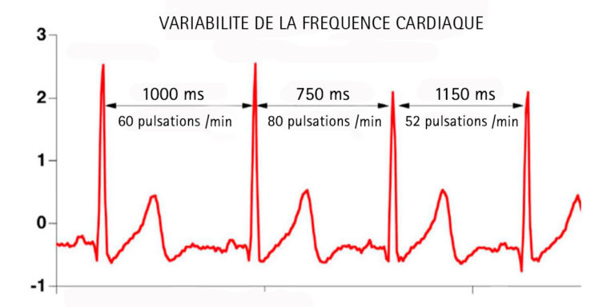
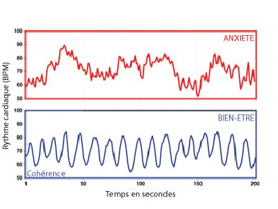

# Coherence cardiaque

## Le cœur un organe méconnu

Le cœur n’est pas juste une pompe. Le réduire à une fonction aussi simpliste nous fait passer à côté de son rôle primordial. En effet, le cœur est un véritable « cerveau secondaire » et joue un rôle important dans notre système nerveux autonome. L’essor récent de la neurocardiologie, c’est-à-dire :

> La discipline qui étudie les interactions et influences réciproques entre le système nerveux et le cœur, tant au niveau physiologique que pathologique,

met en lumière cette dimension méconnue. Cet organe, de prime abord simple, possède des attributs majeurs dans la gestion de nos émotions (qui n’a jamais senti son cœur battre la chamade sous l’effet du stress ?). Comprendre comment interagir avec notre cœur nous permettrait donc d’influer directement sur nos émotions…

## Introduction rapide aux principe cardiaque clé

Comprendre comment influer sur nos émotions nécessite une introduction aux principes clés de la cardiologie.
### Variabilité cardiaque
Sous l’effet des systèmes sympathique et parasympathique, notre pouls, c’est-à-dire le rythme des battements du cœur, est en constante accélération ou décélération. Le rythme en battements par minute (BPM) décrit par notre montre de fitness ne reflète en fait qu’une valeur moyenne sur une durée d’une minute. Les variations du système cardiaque sont imperceptibles à cette échelle de temps : il faudrait une précision à la milliseconde (ms) pour les détecter.

Le facteur le plus important de la variabilité cardiaque est son amplitude, c’est-à-dire la différence entre la valeur maximale et la valeur minimale que l’on peut calculer à partir d’un logiciel de tracé de variabilité cardiaque.

Cette amplitude cardiaque est un indicateur de bonne santé. Plus sa valeur est élevée, plus notre cœur est capable de répondre de façon dynamique aux aléas de notre quotidien. En effet, toutes les activités ayant un impact positif sur la santé tendent à augmenter cette amplitude cardiaque (activité sportive, méditation, techniques de respiration, etc.).

### Chaos cardiaque

Nous vivons dans un monde chaotique, ou il est difficile de prevoir à l'avance les situtations ou nous allons nous trouver d'ici 5 minutes. Notre coeur reagit donc de facon chaotique à ces changements radicaux dans notre quotidien (periode de stress, seance de sport, periode de repos). Ces changement sont géré par deux systeme interne : 
- Le système nerveux sympathique, en stimulant notamment la libération d’adrénaline, accélère le rythme cardiaque et augmente la force de contraction du cœur, lui permettant ainsi de répondre rapidement à des situations de stress ou d’effort.

- À l’inverse, le système nerveux parasympathique, par l’intermédiaire du nerf vague, ralentit le rythme cardiaque et diminue la force de contraction, favorisant un état de repos et de récupération.

### Coherence cardiaque

On peut alors se demander : comment influer sur ces systèmes et éviter d’être les marionnettes de ce « chaos cardiaque » ?

Travailler sur notre respiration est une des solutions :

- Inspirer agit comme un accélérateur pour le corps, cela stimule le système sympathique (c’est d’ailleurs la raison pour laquelle, avant un effort intense, on a tendance à prendre une grande inspiration).
- Expirer ralentit le rythme cardiaque, notamment grâce à la compression de l’abdomen, ce qui stimule le système parasympathique (on souffle souvent profondément une fois un événement stressant passé).

Lorsqu’on utilise consciemment inspiration et expiration pour contrôler les accélérations et décélérations de notre corps, on parle alors de cohérence cardiaque 

Il est d’ailleurs possible de confirmer cet effet en utilisant sa montre cardiaque et en réalisant un tracé de variabilité cardiaque suffisamment fin.

Les effets bénéfiques sont multiples. On peut notamment citer (issus des recherches de l’institut HeartMath en Californie, travaillant sur la cohérence cardiaque depuis 1991) :

**À court terme** (pendant 3 à 6 heures après une séance) :  
- Sentiment d’apaisement et de calme  
- Baisse du cortisol (l’hormone du stress)  
- Augmentation des IgA, améliorant notre défense immunitaire  
- Augmentation des ondes alpha, favorisant la mémorisation et l’apprentissage  
- Augmentation du facteur natriurétique auriculaire, permettant une meilleure modulation de la pression artérielle, ce qui est intéressant dans les cas d’hypertension artérielle  

**À long terme** (en pratiquant régulièrement, avec trois séances de 5 minutes par jour) :  
- Diminution de l’hypertension artérielle  
- Diminution du risque cardiovasculaire  
- Meilleure régulation du taux de sucre  
- Meilleure récupération à l’effort, un facteur intéressant pour les sportifs  
- Diminution des troubles de la concentration et de la mémorisation  
- Diminution de l’anxiété et de la dépression  
- Réduction de l’inflammation

## Comment mettre en place la cohérence cardiaque et la résonance cardiaque

La résonance cardiaque est un cas particulier de la cohérence cardiaque qui permet d’amplifier son effet. Elle repose sur une fréquence respiratoire bien particulière de 0,1 Hz (c’est-à-dire 6 respirations par minute). Cette fréquence sert de référence pour la plupart des séances de cohérence cardiaque.

Un moyen mnémotechnique simple pour intégrer ces séances au quotidien provient du livre *Cohérence cardiaque 365* de David O’Hare :

> **365 = tous les jours de l’année**  
>  - 3 fois par jour  
>  - 6 respirations par minute  
>  - pendant 5 minutes

La première séance, la plus importante de la journée, se situe environ 1 heure après le réveil. En effet, c’est à ce moment que notre sécrétion de cortisol est la plus élevée. Le cortisol nous aide à nous lever le matin et à nous lancer naturellement dans la journée. Cependant, avec l’accumulation des stresseurs de la vie, les niveaux moyens de cortisol se dérèglent. Mettre en place une séance de cohérence cardiaque à ce moment permet de rétablir un bon équilibre.

Il est ensuite conseillé d’espacer ces séances d’environ 4 heures, car les effets immédiats durent en moyenne entre 3 et 6 heures selon les individus.
# Sources

- **Armour J. A. (2004).** *Neurocardiology.* Oxford University Press.  
  *Ouvrage présentant le cœur comme un « cerveau secondaire ».*

- **Institut HeartMath (depuis 1991, Californie).**  
  *Spécialisé dans la recherche sur la cohérence cardiaque.*

- **O’Hare D. (2016).** *Cohérence cardiaque 365.* Éditions Thierry Souccar.  
  *Méthode pratique pour intégrer la cohérence cardiaque dans sa routine quotidienne.*

