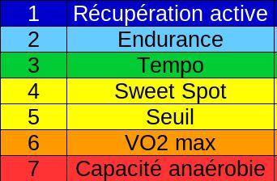

# Calculer Vos Zones Cardio en Fonction de Votre FTP

Connaître vos zones cardio est essentiel pour optimiser vos entraînements, que ce soit pour améliorer votre endurance, brûler des graisses ou travailler votre puissance aérobie. Avec un FTP déterminé, vous pouvez calculer vos zones de manière précise et personnalisée.

## Pourquoi calculer vos zones cardio ?

Les zones cardio permettent d'adapter l'intensité de vos séances à vos objectifs spécifiques. Elles sont au nombre de 7 :

## Un Template pour Simplifier les Calculs

Pour vous aider, j'ai créé un template Google Sheets qui calcule automatiquement vos zones cardio en fonction de votre FTP. Il vous suffit d'entrer votre FTP, et le fichier détermine vos plages de puissance et de fréquence cardiaque idéales pour chaque zone.

## Conseils d'utilisation

- Assurez-vous que votre FTP est à jour pour des calculs précis.
- Utilisez un cardiofréquencemètre pour suivre vos données pendant les entraînements.
- Adaptez vos séances en fonction des zones définies pour maximiser vos résultats.

Entraînez-vous intelligemment en utilisant vos zones cardio comme guide !

